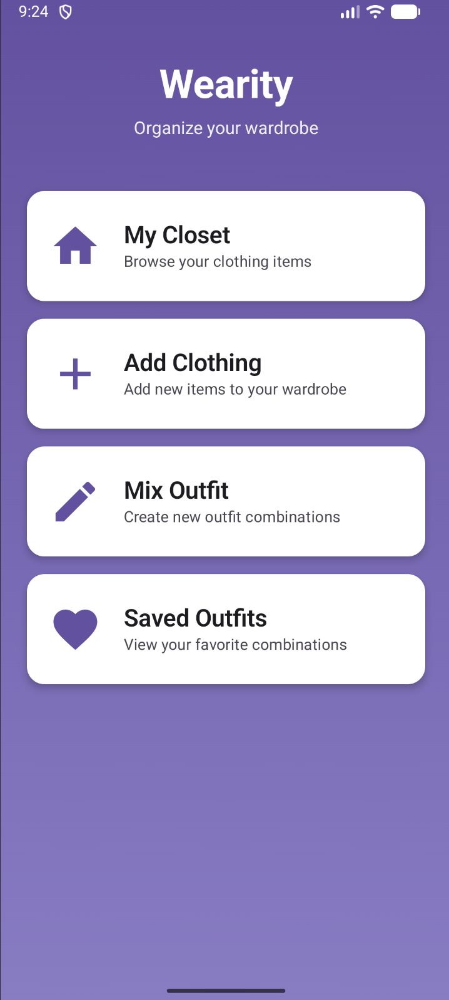
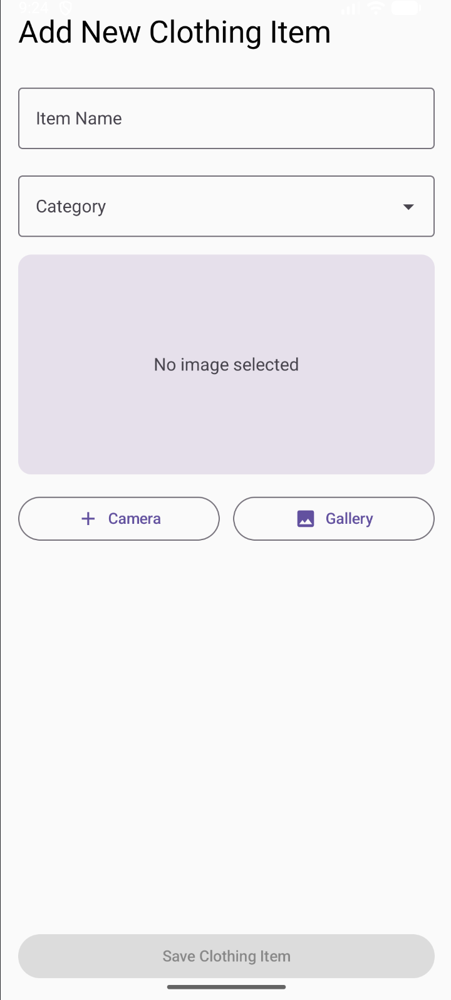
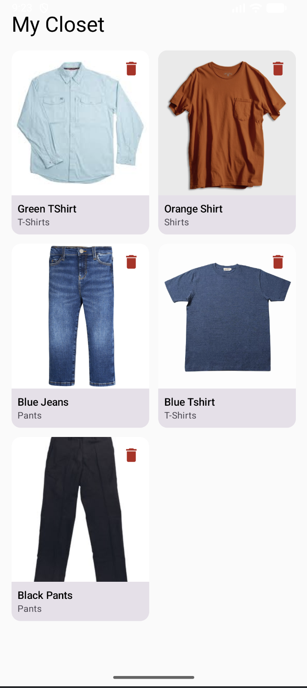
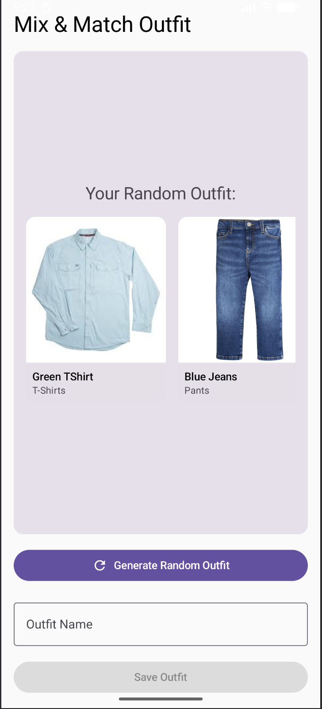

# Wearity 👔

**Organize your wardrobe with style**

Wearity is an Android application that helps you manage your clothing items, create outfit combinations, and organize your wardrobe digitally. Built with Jetpack Compose and modern Android architecture.

## 📱 Screenshots

<table>
  <tr>
    <td></td>
    <td></td>
    <td></td>
  </tr>
  <tr>
    <td align="center">Home Screen</td>
    <td align="center">Add Clothing</td>
    <td align="center">My Closet</td>
  </tr>
  <tr>
    <td></td>
    <td></td>
    <td></td>
  </tr>
  <tr>
    <td align="center">Outfit Mixer</td>
    <td align="center">Saved Outfits</td>
    <td></td>
  </tr>
</table>

## ✨ Features

- **My Closet**: Browse and manage all your clothing items in a grid layout
- **Add Clothing**: Add new items using your camera or gallery with categorization
- **Mix & Match**: Generate random outfit combinations from your wardrobe
- **Saved Outfits**: Save and view your favorite outfit combinations
- **Image Support**: Take photos or select from gallery with persistent storage
- **Smart Categories**: Organize items by type (Shirts, Pants, Shoes, Accessories, etc.)
- **Modern UI**: Beautiful Material 3 design with smooth animations

## 🏗️ Architecture

Wearity follows modern Android development best practices:

- **MVVM Architecture**: Clean separation of concerns
- **Jetpack Compose**: Modern declarative UI
- **Room Database**: Local data persistence
- **Kotlin Coroutines & Flow**: Asynchronous operations
- **Navigation Component**: Type-safe navigation
- **ViewModel**: Lifecycle-aware state management

## 🛠️ Tech Stack

- **Language**: Kotlin
- **UI Framework**: Jetpack Compose
- **Database**: Room
- **Image Loading**: Coil
- **Navigation**: Navigation Compose
- **Async**: Kotlin Coroutines & Flow
- **Architecture**: MVVM
- **DI**: Manual dependency injection
- **Min SDK**: 24 (Android 7.0)
- **Target SDK**: 36

## 📦 Project Structure

```
app/
├── data/
│   ├── model/
│   │   ├── ClothingItem.kt
│   │   └── Outfit.kt
│   ├── db/
│   │   ├── AppDatabase.kt
│   │   ├── ClothingDao.kt
│   │   └── OutfitDao.kt
│   └── ClothingRepository.kt
├── ui/
│   ├── screens/
│   │   ├── HomeScreen.kt
│   │   ├── ClosetScreen.kt
│   │   ├── AddClothingScreen.kt
│   │   ├── OutfitMixerScreen.kt
│   │   └── SavedOutfitsScreen.kt
│   ├── components/
│   │   └── MainScaffold.kt
│   └── theme/
│       ├── Color.kt
│       ├── Theme.kt
│       └── Type.kt
├── viewmodel/
│   ├── ClothingViewModel.kt
│   └── OutfitViewModel.kt
├── navigation/
│   └── AppNavHost.kt
├── utils/
│   └── ImageUtils.kt
└── MainActivity.kt
```

## 🚀 Getting Started

### Prerequisites

- Android Studio Hedgehog (2023.1.1) or newer
- JDK 11 or higher
- Android SDK with API 36

### Installation

1. Clone the repository:
```bash
git clone https://github.com/yourusername/wearity.git
cd wearity
```

2. Open the project in Android Studio

3. Sync Gradle files

4. Run the app on an emulator or physical device

### Building

```bash
# Debug build
./gradlew assembleDebug

# Release build
./gradlew assembleRelease
```

## 📋 Key Features Explained

### Add Clothing Items
- Capture photos directly with your camera
- Select images from your gallery
- Categorize items (19 predefined categories)
- Persistent image storage

### Smart Outfit Generation
The outfit mixer intelligently combines items:
- Pairs tops with bottoms
- Suggests dresses as standalone pieces
- Adds shoes and accessories
- Randomizes combinations for variety

### Data Persistence
- All clothing items stored in Room database
- Images saved with persistable URI permissions
- Outfits saved with item references
- Data survives app restarts

## 🎨 Categories

- Shirts, T-Shirts, Tops
- Pants, Jeans, Shorts
- Dresses, Skirts
- Jackets, Coats, Sweaters, Hoodies
- Hats, Caps
- Shoes, Sneakers, Boots
- Accessories
- Other

## 📄 License

This project is licensed under the MIT License - see the [LICENSE](LICENSE) file for details.

## 🤝 Contributing

Contributions are welcome! Please feel free to submit a Pull Request.

1. Fork the project
2. Create your feature branch (`git checkout -b feature/AmazingFeature`)
3. Commit your changes (`git commit -m 'Add some AmazingFeature'`)
4. Push to the branch (`git push origin feature/AmazingFeature`)
5. Open a Pull Request

## 📞 Contact

Project Link: [https://github.com/yourusername/wearity](https://github.com/yourusername/wearity)

## 🙏 Acknowledgments

- Material Design 3 for UI guidelines
- Jetpack Compose for modern Android UI
- Coil for efficient image loading
- The Android developer community

---

**Made with ❤️ using Jetpack Compose**
